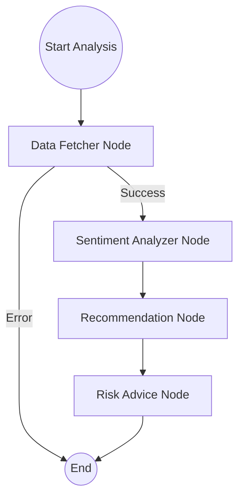

# 🛡️ TradeSentinel

**Private · Agentic · SLM-Powered Trading Intelligence for Indian Retail Investors**

TradeSentinel is a 100% local, private, Small Language Model (SLM) powered trading assistant. It helps retail traders in India save hours of research by providing instant, unbiased insights on NSE stocks using a multi-step agentic workflow.

---

## 🚀 Key Features

- **Stock Analyzer**: Complete autonomous analysis combining technical indicators, fundamental data, and news sentiment.
- **Intraday Insights**: High-frequency momentum analysis (5-minute intervals) with precise entry, exit, and stop-loss targets.
- **Portfolio Manager**: Local tracking of holdings with AI-powered portfolio audits and personalized averaging strategies.
- **Market Discoverer**: Scans Large, Mid, and Small Cap segments to surface oversold or high-momentum opportunities.
- **Privacy First**: Designed to run fully offline using Ollama (phi3:mini) for maximum data privacy.

---

## 🛠️ How It Works (The Core Flow)

TradeSentinel uses **LangGraph** to orchestrate a sophisticated agentic workflow. The process is broken down into modular nodes that communicate via a shared state.

### 1. The Agentic Workflow
The main analysis flow follows this path:



*   **Data Fetcher**: Retrieves OHLCV (Price/Volume) data, technical indicators (RSI, Trends), and business fundamentals via MCP tools.
*   **Sentiment Analyzer**: Processes recent news headlines using an SLM to determine market sentiment.
*   **Recommendation**: Synthesizes data and sentiment to provide a `BUY`, `HOLD`, or `SELL` call with clear reasoning and target zones.
*   **Risk Advice**: Personalizes the final output based on the user's risk profile (Conservative/Moderate/Aggressive) and existing portfolio holdings.

### 2. Model Context Protocol (MCP) Integration
TradeSentinel exposes its core capabilities through an **MCP Server** (`mcp_server.py`), acting as a standardized bridge between data sources and agentic logic.

- **Tools**: `get_stock_info`, `analyze_data`, `analyze_fundamentals`, `get_market_insights`, `scan_markets`.
- **Resources**: `portfolio://current`.

---

## 📈 Standardizing the Workflow for Maximum Benefit

To get the most out of TradeSentinel, the workflow is standardized around several key principles:

1.  **Unified Data Interface**: All analysis nodes consume data through standardized MCP tools, ensuring consistency whether the data comes from `yfinance`, `TradingView`, or local files.
2.  **Structured SLM Interaction**: The system enforces JSON-only outputs from SLMs. This standardization reduces parsing errors and ensures the UI always receives reliable data.
3.  **Modular Strategy Nodes**: By separating "Stock Analysis" from "Intraday Analysis," users can deploy specific models/prompts tailored to different timeframes (daily vs. 5-minute).
4.  **Privacy-Centric Inference**: By standardizing on `Ollama`, your trading strategies and portfolio data never leave your local machine.

---

## 📦 Quick Start

### 1. Prerequisites
- [Ollama](https://ollama.ai/) installed and running.
- Pull the required model: `ollama pull phi3:mini`.
- Python 3.10+ installed.

### 2. Setup
```bash
git clone https://github.com/maneesh-nandreddy/trade-sentinel.git
cd trade_sentinel
python -m venv venv
source venv/bin/activate  # On Windows: venv\Scripts\activate
pip install -r requirements.txt
```

### 3. Environment Variables
Create a `.env` file from `.env.example`:
```bash
GROQ_API_KEY=your_key_here  # Optional: only if using Groq inference
```

### 4. Run the App
```bash
streamlit run app.py
```

---

## 🛡️ License
This project is private and intended for educational and personal use only. Not financial advice.
